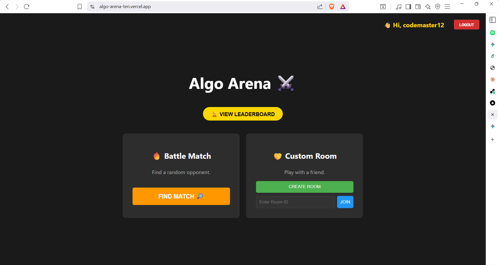
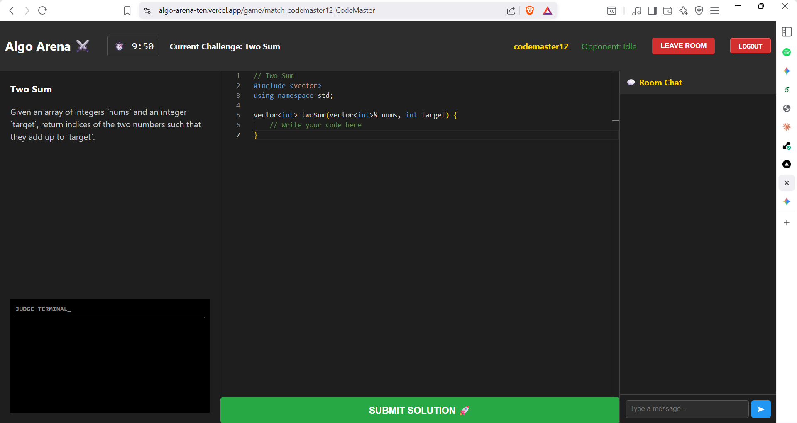

# Algo-Arena

**Algo-Arena** is a real-time multiplayer competitive coding platform where developers battle 1-v-1 to solve algorithmic challenges. It features live state synchronization, an AI-powered code judge, and an integrated post-match review system.


## Features

* **Real-Time Multiplayer:** Instant 1-v-1 matchmaking and live game state synchronization using Socket.io.
* **AI Judge Engine:** Server-side code evaluation powered by Google Gemini 2.5 Flash API, supporting multiple edge cases and providing instant verdicts (Accepted/Wrong Answer).
* **Robust Game Logic:** Handles race conditions (simultaneous submits), disconnects, and draws with fair score calculation.
* **In-Game Chat:** Real-time messaging system for players to communicate during the match.
* **Post-Match Review:** "Stay & Chat" mode allows players to analyze their code and discuss solutions for 5 minutes after the game ends.
* **Resilient Architecture:** Implements auto-retry mechanisms and exponential backoff to handle API rate limits during high traffic.

## Tech Stack

* **Frontend:** React.js, Vite, Monaco Editor (Code Editor)
* **Backend:** Node.js, Express.js
* **Real-Time:** Socket.io (WebSockets)
* **Database:** MongoDB (User profiles, Match history)
* **AI Integration:** Google Gemini API
* **Deployment:** Vercel (Client) + Render (Server)

## Screenshots

| Match Found | Real-Time Battle | Game Over |
|:---:|:---:|:---:|
|  |  |  |

## Installation & Setup

Follow these steps to run the project locally.

### 1. Clone the Repository
```bash
git clone https://github.com/Kirit-Jain/Algo-Arena.git
cd algo-arena
```

### 2. Backend Setup
Navigate to the server directory and install dependencies:
```bash
cd server
npm install
```
Environment Configuration: Create a file named .env in the server directory and add the following keys.
```bash
# Server Port
PORT=3001

# Database Connection (MongoDB Atlas)
MONGO_URI=your_mongodb_connection_string

# AI Judge (Google Gemini API)
GEMINI_API_KEY=your_google_gemini_key

# Frontend URL (For CORS Policy)
CLIENT_URL=http://localhost:5173
```

Start the backend server:
```bash
npm start
```

### 3. Frontend Setup
Open a new terminal, navigate to the client directory, and install dependencies:

```bash
cd client
npm install
```

Environment Configuration: Create a file named .env in the client directory:

```bash
# URL of the Backend Server
VITE_API_URL=http://localhost:3001
```

Start the frontend application:
```bash
npm run dev
```

## System Architecture
* **Matchmaking:** Users join a queue. The server pairs them and creates a unique RoomID.

* **Synchronization:** When Player A types, Socket.io broadcasts "Typing..." to Player B.

* **Submission:** Code is sent to the backend -> forwarded to Gemini API -> Verdict returned.

* **Win Condition:**

  * Instant Win: If verdict is "Accepted", the game ends immediately.

  * Timer Expiry: Highest score wins.

## Contributing
Contributions are welcome! Please fork the repository and submit a pull request.

## License
This project is licensed under the MIT License.